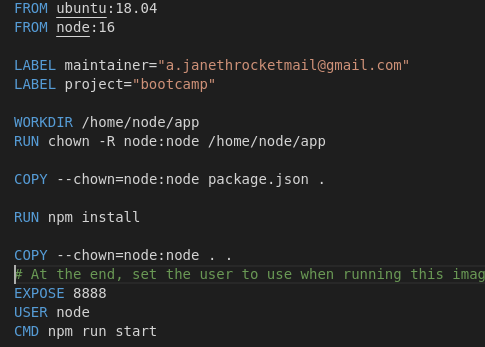

# Bootcamp-4-Challenge CICD

## Práctica 1

Dado este proyecto en NodeJS, crea su Dockerfile sabiendo que nos han pedido como imagen base ubuntu:18.04, versión 16 de NodeJS, el 8888 será el puerto donde exponga la comunicación la applicación, la señal de *STOP* debe llegarle a la aplicación y el contenedor podría ser iniciado con cualquier proceso.

## Práctica 2

Sube la imagen de Docker a DockerHub.

[DockerHub](https://hub.docker.com/r/yjd7/ubuntu)

## Práctica 3

Automatiza el proceso de creación de la imagen de Docker y su subida a Docker Hub después de cada cambio en el repositorio utitlizando Github Actions.

[AutomatizaScript.sh](https://github.com/virginiayjd7/bootcamp-4-challenge/blob/master/.github/script1.sh)

## Práctica 4

Se debe crear una aplicación en Heroku y desplegarla allí usando github actions.

[GithubActions](https://github.com/virginiayjd7/bootcamp-4-challenge/blob/master/.github/workflows/deploy.yml)

### Resultado:

